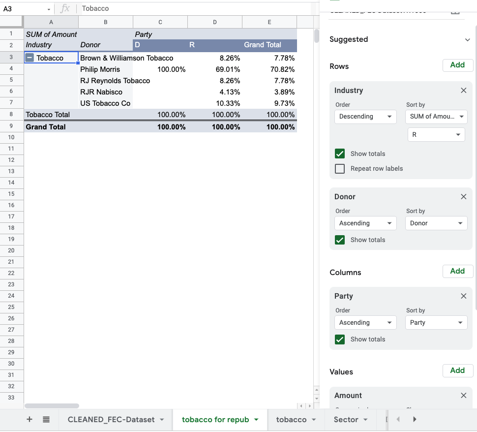

# Data Cleaning
1. open the data file https://drive.google.com/file/d/12EDYe0DNDbvi8IHy0RwAPtoais6YOHka/view and open it in Google spreadsheet
2. make a copy called [Original]Dataset_SOFT100K_95-96
3. operate on the google spreadsheet file called [Active] Dataset_SOFT100K_95-96
4. freeze the first row and make it bold.
5. In google spreadsheet, 
   * go to Data-Data Cleanup-Cleanup Suggestions, find 15 duplicate rows, remove them (they are all adjacent rows, so I figure it is duplicate and should be removed) 
   *  highlight the Zip column, change the data format to five-digit number by going to Format - number - custom number format - 00000
6. download the spreadsheet as csv. and upload it to OpenRefine
   * trim leading and trailing whitespace
   * create text facet for Party column
     * change 3 to NLP
   * create text facet for Zip column
     *  row: 207 put 10016 in the Zip column
     *  row: 369 put 76155 in the Zip column
   * create text facet on City column
     * change Bethelehem to Bethlehem
     * change Sonnywale to Sunnyvale
     * change New Yorkrook to New York
     * change Dallas/fort Worth to Dallas
   * create text facet on Recipient column
     * spell out all Cmte to Committee
     * change all Repub to Republican
     * change RNC to Republican National Committee
     * change DNC to Democratic National Committee
   * export it as csv. and upload it on Google Spreadsheet

# Questions
1. Which industries contributed the most to the Republican and Democratic parties? How much was contributed to each party?
   * Insert - Pivot Table
   * put industry in rows, party in columns, Amount in values
   * Democratic:
     * sort rows by SUM of Amount-D in descending order
     * Media/Entertainment industry contributed to the Democratic party the most. The amount was $1,880,000.
     
     
   * Republican:  
     * sort rows by SUM of Amount-R in descending order
     * Republican/Conservative industry contributed to the Republican party the most. The amount was $4,939,000.  
     
     
2. How much did donors from the Misc. Business sector contribute to the Democratic party? Which donors were based in Miami Lakes, FL?
   * Insert - Pivot Table
   * put sector in rows, party in columns and amount in values
   * sort rows by SUM of Amount-D in descending order
   * Donors from the Misc. Business sector contributed $3,520,000 to the Democratic party. 
   * double click the $3,520,000 cell
   * create filter, filter City column to Miami Lakes
   * The donor Windmere Corp was based in Miami Lakes, FL.
   
   
3. What percentage of the tobacco industry’s donations does Philip Morris account for? How much is it?
   * Insert - Pivot Table
   * put industry in Filters, filter to tobacco
   * put industry in columns, put donor in rows, put Amount in values
   * sort rows by SUM of Amount-Tobacco in descending order
   * We see Philip Morris donated $1,820,000. 
   * in the section of values, show as % of column
   * Philip Morris accounted for 70.82% of the tobacco industry's donations. 
   
   
4. Story Idea
   * Put industry in rows, party in columns, amount in values
   * Sort industry by SUM of Amount-R
   * The tobacco industry contributed $2,420,000 to the Republican party. 
   * Put industry in filters and filter only the tobacco industry
   * add donor in rows too
   * Show values as % of column
   * The money from Philip Morris accounted for 69.01% of the amount from the tobacco industry to the Republican party.
   
   

